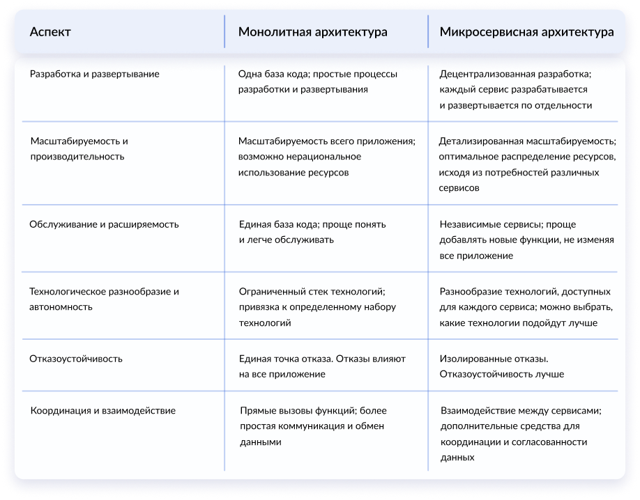
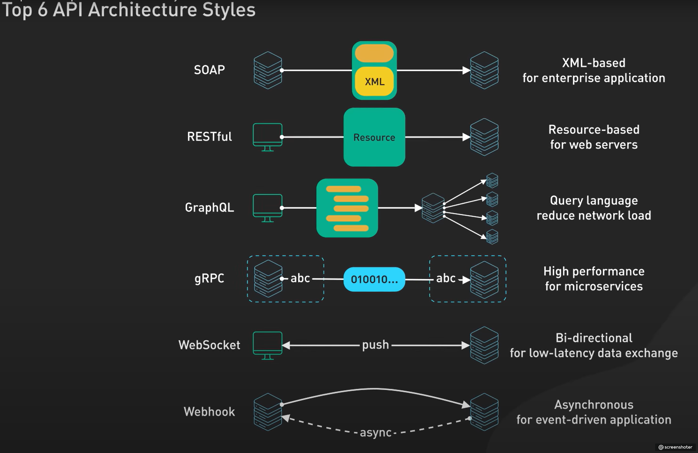
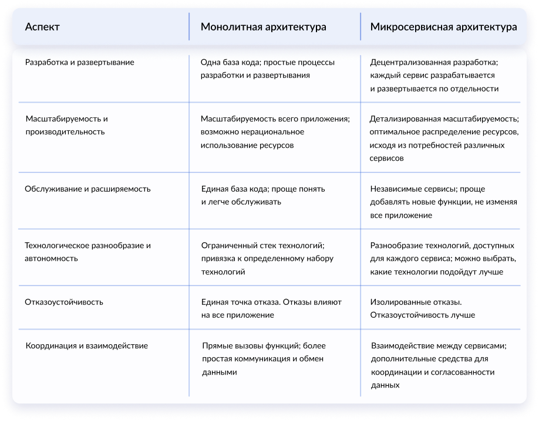

1. Модели жизненного цикла ПО
Этапы жизненного цикла
1. Анализ (подготовка)
2. Проектирование
3. Создание (программирование)
4. Тестирование
5. Внедрение
6. Сопровождение

*Модель *разработки программного обеспечения описывает, какие стадии жизненного цикла оно проходит и что происходит на каждой из них.

М*етодология* включает в себя набор методов по управлению разработкой: это правила, техники и принципы, которые делают её более эффективной.

Модели разработки
1.

### Waterfall (каскадная модель, или «водопад»)

2.

### V-образная модель (разработка через тестирование)

3.

### Incremental Model (инкрементная модель)

4.

### S**piral Model (спиральная модель)**

5.

### Agile Model - гибкая модель разработки, по которой сегодня работает большинство ИТ-проектов.Представляет собой совокупность различных подходов к разработке ПО.

**Основные идеи Agile:**

- люди и взаимодействие важнее процессов и инструментов;
- работающий продукт важнее исчерпывающей документации;
- сотрудничество с заказчиком важнее согласования условий контракта;
- готовность к изменениям важнее следования первоначальному плану.

**Преимущества:**

- после каждой итерации заказчик может наблюдать результат и понимать, удовлетворяет он его или нет.
- быстрое принятие решений за счет постоянных коммуникаций;
- минимизация рисков;
- облегченная работа с документацией.

**Недостатки:**

**- **большое количество митингов и бесед, что может увеличить время разработки продукта;

- сложно планировать процессы, так как требования постоянно меняются;
- редко используется для реализации больших проектов.

2. Методы тестирования
**Тестирование методом «чёрного ящика»:**
**Тестирование методом «белого ящика»:**
**Тестирование методом «серого ящика»:**
**
**
3.Виды тестирования
По уровню тестирования:

- Модульное
- Интеграционное
- Системное

По целям:

- Функционал
- Не функционал

Удобство
Защищённость
Инсталяция
Производительность

4.Принципы тестирования
1. Тестирование демонстрирует наличие дефектов
2. Исчерпывающее тестирование невозможно
3. Раннее тестирование
4. Скопление дефектов
5. Парадокс пестицида
6. Тестирование зависит от контекста
7. Заблуждение об отсутствии ошибок

5.Тест дизайн
1. Классы эквивалентности
2. Граничные значения
3. Попарное тестирование
4. Диаграмма состояний
5. Таблица принятия решений

6.Уровни тестирования
1. Модульное (юнит тестирование)
2. Интеграционное (оба компонента тест в интеграции)
3.

### Системное тестирование (Проверка всех компонентов вместе)

4.

### Приемочное тестирование

7. Написание тестовых артефактов
Скип

8.Локализация багов с помощью логов
Сделать при наличии времени

9.Клиент-сервер
1. Монолит
Плюсы:

- производительность и эффективность
- среда совместно используемых данных

Минусы:

- масштабирование
- завязаны на определенном стеке технологий
- развертывания и обслуживания

Микросервис
Плюсы:

- масштабируемость и гибкость
- технологическое разнообразие и автономия
- Удобное ci/cd

Минусы:

- сложности с управлением распределенной системой (куча сервисов, куча БД, очереди, пропажа запросов)
- сложнее поддерживать их взаимодействие и согласованность данных



10.Сайт, Веб-приложение, Веб-сервис

Веб-сайт - это интерфейс к веб-сервисам и доп. странички, которые, строго говоря, не относятся к веб-сервисам (например, страничка - "О нас").

Веб-приложение - функционал веб-сайта или веб-сервиса с точки зрения разработчика, а не с точки зрения пользователя. Возможно, одно веб-приложение - это целиком веб-сайт. Или же набор отдельных веб-приложений.

10.API

11.Кэш, куки и тд
Кэш

Кэш — это память программы или устройства, которая сохраняет временные или часто используемые файлы для быстрого доступа к ним.

Это увеличивает скорость работы приложений и операционной системы.

Куки

Это хранящиеся на компьютерах и гаджетах небольшие файлы, c помощью которых сайт запоминает информацию о посещениях пользователя.

Куки хранят что угодно: предпочтения П, посещённые страницы, данные по аналитике и тд

`localStorage`

Это место в браузере пользователя, в котором сайты могут сохранять разные данные.

Лучше чем хранить инфу в куках, больше места и не надо постоянно передавать данные туда сюда как в куках.

**Сессия (session)** – это некоторый отрезок во времени, в пределах которого веб-приложение может определять все запросы от одного клиента.

12. Git, ide

- [ ] Откатить локальный мёрж конфликт git merge --abort
- [ ] Удалить локальный коммит с изменениями git reset --hard HEAD~1 (цифра говорит сколько удалить последних коммитов)
- [ ] Удалить локальный коммит без изменений git reset --soft HEAD~1 (цифра говорит сколько удалить последних коммитов)
- [ ] Откатиться к определённому коммиту удалив все локальные наработки git reset --hard хэш коммита
- [ ] Откатиться к определённому коммиту не удаляя все локальные наработки git reset --soft хэш коммита
- [ ] Удалить локальную ветку git branch -d namebranch
- [ ] git stash - Сохранить локальные изменения в память
- [ ] git stash list - Проверить локальные изменения в стеше
- [ ] git stash apply - Применить изменения из стеша
- [ ] Открыть коммит в ide? git status
- [ ] Посмотреть историю коммитов git log
- [ ] git checkout fdg23r4fge4(хэш коммита к которому надо откатиться) -- API/tests/test_create_user.py (путь к файлу который откатываем)
- [ ] ctrl+shift+f or double shift

13.Python

1. Python — это язык программирования высокого уровня, интерпретируемый, с динамической типизацией и автоматическим управлением памятью.

2. Python является императивным языком программирования. В императивном программировании программист составляет последовательность команд, которые выполняются компьютером.

3. **Python** сначала компилирует исходный текст сценария в байт-код для виртуальной машины. После компиляции в байт-код, создается файл в pycache. В след раз если не было изменений, то пайтон передаст этот файлик с байт кодом напрямую вирт машине минуя этап компиляции.

После того как пройдет процесс компиляции, байт-код передается механизму под названием **виртуальная машина**, которая и выполнит инструкции из байт-кода.

4. Туда же

5. Поддерживает все основные принципы ООП: наследование, инкапсуляция, полиморфизм, множественное наследование.

6. PEP 8, или Python Enhancement Proposal 8. Этот документ содержит рекомендации и правила, которым стоит следовать, чтобы ваш код был легко читаемым, понятным и единообразным.

7. Библиотека представляет собой готовых решений для различных задач в виде модулей или функций.

Фреймворк представляет собой интегрированный набор компонентов и инструментов, который предоставляет готовое решение для решения определенной задачи.

8. Docstring в Python — это строка документации, которая описывает, что делает функция, метод, модуль или класс Python.

9. Каталог pycache автоматически создается интерпретатором Python и используется для хранения скомпилированных файлов байт-кода.

10. Модуль — это файл с кодом, который можно использовать повторно, а пакет — это директория, которая может содержать один или несколько модулей.

11. Менеджер пакетов — это инструмент, который позволяет управлять установкой, обновлением и удалением библиотек и зависимостей в проектах на языке Python.

- pip — это стандартный менеджер пакетов Python. Он позволяет устанавливать пакеты из Python Package Index (PyPI) и других источников
- conda
- easy_install - древность до Python 3
- poetry — новый менеджер пакетов, предназначенный для замены в некоторой степени pip и virtualenv.

12. Типы данных в Python:

- числовые типы данных: int, float, и complex;
- строковые типы данных: str;
- коллекции: list, tuple, dict, и set;
- булевы типы данных: bool.

13. В Python ключевое слово self используется для обращения к текущему объекту класса. Оно передается как первый аргумент в методы класса и позволяет работать с атрибутами и методами объекта класса внутри этих методов.

14. Код, находящийся в файле [init.py](http://init.py), может инициализировать переменные, функции и классы, что обеспечивает общую функциональность для всех модулей, находящихся внутри пакета.

15. Не оч понял, рассказать про обычное и множественное наследование?
16.

```

text = """Дорогой {name} {mid_name},  баланс Вашего лицевого счёта составляет {balance} руб.""".format(mid_name=mid_name, name=name, balance=balance)

text = f"""Дорогой {name} {mid_name},  баланс Вашего лицевого счёта составляет {balance} руб."""

```

Архитектурывтыфвф

Одноуровневая архитектура предполагает распределение прикладного ПО по отдельным рабочим единицам, обращающимися при взаимодействии к одному серверу.

В двухуровневой архитектуре уже присутствуют прикладные программы. Они располагаются на специально выделенном сервере ПО. А вот программы-клиенты, предоставляющие пользовательский интерфейс для взаимодействия с приложениями, размещены в рабочих единицах.

