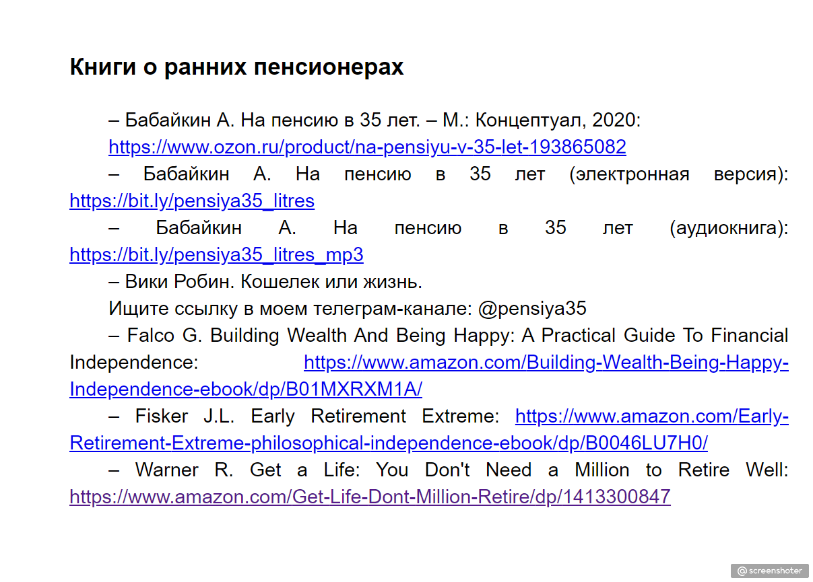

Блоки, сайты:

– Бабайкин, телеграм-канал «На пенсию в 35 лет»: https://t.me/pensiya35
– Олег Клоченок, «Вокруг да около»: https://roundabout.ru/
– Лариса Морозова, «Дивиденды Forever»: https://t.me/divForever

– Ильшат Юмагулов, пенсионный фонд «Кубышка»: https://zen.yandex.ru/moneybag2034

– Александр Бабинцев, «Стратегия ленивой блондинки»: http://mywayoftheinvestor.ru/

– Александр Силаев, «Деньги без дураков»: https://vk.com/dengi_bez_durakov
– Mr. Money Mustache*: https://www.mrmoneymustache.com/

*Американский «пенсионер». Перестал работать в 30 с небольшим лет. Для этого ему понадобилась сумма в $600 000. Живет на дивиденды.

– Mad Fientist*: https://www.madfientist.com/

*Инвестор, блогер и ведущий подкаста. Рассказывает о налоговой оптимизации и личных финансах сквозь призму ранней пенсии.

– Financial independence / Early retirement – крупнейшее в мире сообщество ранних пенсионеров из разных стран: https://www.reddit.com/r/financialindependence/

– Морган Хаузел*: https://www.collaborativefund.com/blog/

*Один из лучших финансовых блогеров в Reddit и Twitter, автор книг по инвестированию.

Книги о ранних пенсионерах:

